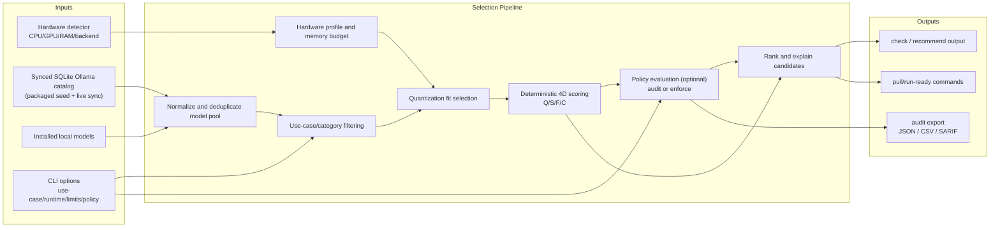

# LLM Checker


**Intelligent Ollama Model Selector**

AI-powered CLI that analyzes your hardware and recommends optimal LLM models.  
Deterministic scoring across **200+ Ollama models** and **7k+ variants** with a packaged SQLite catalog, live sync, and hardware-calibrated memory estimation.

[](https://www.npmjs.com/package/llm-checker)
[](https://www.npmjs.com/package/llm-checker)
[](LICENSE)
[](https://discord.gg/mnmYrA7T)
[](https://nodejs.org/)

[Start Here](#start-here-2-minutes) •
[Installation](#installation) •
[Quick Start](#quick-start) •
[Calibration Quick Start](#calibration-quick-start-10-minutes) •
[Docs](https://github.com/Pavelevich/llm-checker/tree/main/docs) •
[Claude MCP](#claude-code-mcp) •
[Commands](#commands) •
[Scoring](#scoring-system) •
[Hardware](#supported-hardware) •
[Discord](https://discord.gg/mnmYrA7T)

---

## Why LLM Checker?

Choosing the right LLM for your hardware is complex. With thousands of model variants, quantization levels, and hardware configurations, finding the optimal model requires understanding memory bandwidth, VRAM limits, and performance characteristics.

**LLM Checker solves this.** It analyzes your system, scores every compatible model across four dimensions (Quality, Speed, Fit, Context), and delivers actionable recommendations in seconds.

---

## Features

| | Feature | Description |
|:---:|---|---|
| **200+** | Packaged Model Catalog | Ships with a synced Ollama SQLite catalog and can refresh from Ollama on demand |
| **4D** | Scoring Engine | Quality, Speed, Fit, Context &mdash; weighted by use case |
| **Multi-GPU** | Hardware Detection | Apple Silicon, NVIDIA CUDA, AMD ROCm, Intel Arc, CPU, integrated/dedicated inventory visibility |
| **Calibrated** | Memory Estimation | Bytes-per-parameter formula validated against real Ollama sizes |
| **Zero** | Native Dependencies | Pure JavaScript &mdash; works on any Node.js 16+ system |
| **Live** | AI Run Metrics | `ai-run` shows response speed in tokens/sec next to model output |

---

## Documentation

- [Docs Hub](https://github.com/Pavelevich/llm-checker/tree/main/docs)
- [Usage Guide](https://github.com/Pavelevich/llm-checker/blob/main/docs/guides/usage-guide.md)
- [Advanced Usage](https://github.com/Pavelevich/llm-checker/blob/main/docs/guides/advanced-usage.md)
- [Technical Reference](https://github.com/Pavelevich/llm-checker/blob/main/docs/reference/technical-docs.md)
- [Changelog](https://github.com/Pavelevich/llm-checker/blob/main/docs/reference/changelog.md)
- [Calibration Fixtures](https://github.com/Pavelevich/llm-checker/tree/main/docs/fixtures/calibration)

---

## Comparison with Other Tooling (e.g. `llmfit`)

LLM Checker and `llmfit` solve related but different problems:

| Tool | Primary Focus | Typical Output |
|------|---------------|----------------|
| **LLM Checker** | Hardware-aware **model selection** for local inference | Ranked recommendations, compatibility scores, pull/run commands |
| **llmfit** | LLM workflow support and model-fit evaluation from another angle | Different optimization workflow and selection heuristics |

If your goal is: *"What should I run on this exact machine right now?"*, use **LLM Checker** first.  
If your goal is broader experimentation across custom pipelines, using both tools can be complementary.

---

## Installation

```bash
# Install globally
npm install -g llm-checker

# Or run directly with npx
npx llm-checker hw-detect
```

**Termux (Android):**
```bash
pkg update
pkg install ollama
npm install -g llm-checker
```

**Requirements:**
- Node.js 16+ (any version: 16, 18, 20, 22, 24)
- [Ollama](https://ollama.ai) installed for running models

The package includes a prebuilt model catalog and declares `sql.js` as an optional dependency for SQLite-powered commands. If your package manager skips optional dependencies and database commands report `sql.js` missing, reinstall with optional dependencies enabled:

```bash
npm install -g llm-checker --include=optional
```

---

## Start Here (2 Minutes)

If you are new, use this exact flow:

```bash
# 1) Install
npm install -g llm-checker

# 2) Detect your hardware
llm-checker hw-detect

# 3) Get recommendations by category
llm-checker recommend --category coding

# 4) Refresh the catalog when you want current Ollama references
llm-checker sync

# 5) Run with auto-selection and tokens/sec metrics
llm-checker ai-run --category coding --prompt "Write a hello world in Python"
```

If you already calibrated routing:

```bash
llm-checker ai-run --calibrated --category coding --prompt "Refactor this function"
```

---

## Distribution

LLM Checker is published in all primary channels:

- npm (latest, recommended): [`llm-checker@latest`](https://www.npmjs.com/package/llm-checker)
- GitHub Releases: [Release history](https://github.com/Pavelevich/llm-checker/releases)
- GitHub Packages (legacy mirror, may lag): [`@pavelevich/llm-checker`](https://github.com/users/Pavelevich/packages/npm/package/llm-checker)

### Important: Use npm for Latest Builds

If you need the newest release, install from npm (`llm-checker`), not the scoped GitHub Packages mirror.

If you installed `@pavelevich/llm-checker` and version looks old:

```bash
npm uninstall -g @pavelevich/llm-checker
npm install -g llm-checker@latest
hash -r
llm-checker --version
```

### v3.5.13 Highlights

- Ships npm packages with a ready-to-use SQLite model catalog:
  - 229 Ollama models
  - 7176 variants
  - real pull counts and `last_updated` metadata
- `sync` refreshes the local SQLite catalog from Ollama; `recommend`, `list-models`, `ai-run`, and `ai-check` now prefer that synced catalog instead of stale scraper cache data.
- Recommendation normalization was hardened:
  - no more `pulls: 0` for the full catalog after sync
  - `335m` style tags are treated as millions, not billions
  - ambiguous aliases like `latest`, `small`, `medium`, and `large` are not guessed into fake parameter counts
  - cloud variants are filtered out of local recommendations
- `ai-run` streams model responses through Ollama and appends measured tokens/sec so users can compare installed models by real local speed.
- The interactive panel no longer asks for optional parameters before every command.

### v3.3.0 Highlights

- Calibrated routing is now first-class in `recommend` and `ai-run`:
  - `--calibrated [file]` support with default discovery path.
  - clear precedence: `--policy` > `--calibrated` > deterministic fallback.
  - routing provenance output (source, route, selected model).
- New calibration fixtures and end-to-end tests for:
  - `calibrate --policy-out ...` → `recommend --calibrated ...`
- Hardened Jetson CUDA detection to avoid false CPU-only fallback.
- Documentation reorganized under `docs/` with clearer onboarding paths.

### Optional (Legacy): Install from GitHub Packages

Use this only if you explicitly need GitHub Packages. It may not match npm latest.

```bash
# 1) Configure registry + token (PAT with read:packages)
echo "@pavelevich:registry=https://npm.pkg.github.com" >> ~/.npmrc
echo "//npm.pkg.github.com/:_authToken=${GITHUB_TOKEN}" >> ~/.npmrc

# 2) Install
npm install -g @pavelevich/llm-checker@latest
```

---

## Quick Start

```bash
# 1. Detect your hardware capabilities
llm-checker hw-detect

# 2. Get full analysis with compatible models
llm-checker check

# 3. Get intelligent recommendations by category
llm-checker recommend

# 4. Refresh the catalog when you want current Ollama metadata
llm-checker sync
llm-checker search qwen --use-case coding
```

---

## Calibration Quick Start (10 Minutes)

This path produces both calibration artifacts and verifies calibrated routing in one pass.

### 1) Use the sample prompt suite

```bash
cp ./docs/fixtures/calibration/sample-suite.jsonl ./sample-suite.jsonl
```

### 2) Generate calibration artifacts (dry-run)

```bash
mkdir -p ./artifacts
llm-checker calibrate \
  --suite ./sample-suite.jsonl \
  --models qwen2.5-coder:7b llama3.2:3b \
  --runtime ollama \
  --objective balanced \
  --dry-run \
  --output ./artifacts/calibration-result.json \
  --policy-out ./artifacts/calibration-policy.yaml
```

Artifacts created:

- `./artifacts/calibration-result.json` (calibration contract)
- `./artifacts/calibration-policy.yaml` (routing policy for runtime commands)

### 3) Apply calibrated routing

```bash
llm-checker recommend --calibrated ./artifacts/calibration-policy.yaml --category coding
llm-checker ai-run --calibrated ./artifacts/calibration-policy.yaml --category coding --prompt "Refactor this function"
```

Notes:

- `--policy <file>` has precedence over `--calibrated [file]`.
- If `--calibrated` has no path, discovery uses `~/.llm-checker/calibration-policy.{yaml,yml,json}`.
- `--mode full` currently requires `--runtime ollama`.
- `./docs/fixtures/calibration/sample-generated-policy.yaml` shows the expected policy structure.

---

## Claude Code MCP

LLM Checker includes a built-in [Model Context Protocol](https://modelcontextprotocol.io/) (MCP) server, allowing **Claude Code** and other MCP-compatible AI assistants to analyze your hardware and manage local models directly.

### Setup (One Command)

```bash
# Install globally first
npm install -g llm-checker

# Add to Claude Code
claude mcp add llm-checker -- llm-checker-mcp
```

Or generate the exact command directly from the CLI:

```bash
llm-checker mcp-setup
```

Or with npx (no global install needed):

```bash
claude mcp add llm-checker -- npx llm-checker-mcp
```

Restart Claude Code and you're done.

### Available MCP Tools

Once connected, Claude can use these tools:

**Core Analysis:**

| Tool | Description |
|------|-------------|
| `hw_detect` | Detect your hardware (CPU, GPU, RAM, acceleration backend) |
| `check` | Full compatibility analysis with all models ranked by score |
| `recommend` | Top model picks by category (coding, reasoning, multimodal, etc.) |
| `installed` | Rank your already-downloaded Ollama models |
| `search` | Search the Ollama model catalog with filters |
| `smart_recommend` | Advanced recommendations using the full scoring engine |
| `ollama_plan` | Build a capacity plan for local models with recommended context/parallel/memory settings |
| `ollama_plan_env` | Return ready-to-paste `export ...` env vars from the recommended or fallback plan profile |
| `policy_validate` | Validate a policy file against the v1 schema and return structured validation output |
| `audit_export` | Run policy compliance export (`json`/`csv`/`sarif`/`all`) for `check` or `recommend` flows |
| `calibrate` | Generate calibration artifacts from a prompt suite with typed MCP inputs |

**Ollama Management:**

| Tool | Description |
|------|-------------|
| `ollama_list` | List all downloaded models with params, quant, family, and size |
| `ollama_pull` | Download a model from the Ollama registry |
| `ollama_run` | Run a prompt against a local model (with tok/s metrics) |
| `ollama_remove` | Delete a model to free disk space |

**Advanced (MCP-exclusive):**

| Tool | Description |
|------|-------------|
| `ollama_optimize` | Generate optimal Ollama env vars for your hardware (NUM_GPU, PARALLEL, FLASH_ATTENTION, etc.) |
| `benchmark` | Benchmark a model with 3 standardized prompts — measures tok/s, load time, prompt eval |
| `compare_models` | Head-to-head comparison of two models on the same prompt with speed + response side-by-side |
| `cleanup_models` | Analyze installed models — find redundancies, cloud-only models, oversized models, and upgrade candidates |
| `project_recommend` | Scan a project directory (languages, frameworks, size) and recommend the best model for that codebase |
| `ollama_monitor` | Real-time system status: RAM usage, loaded models, memory headroom analysis |
| `cli_help` | List all allowlisted CLI commands exposed through MCP |
| `cli_exec` | Execute any allowlisted `llm-checker` CLI command with custom args (policy/audit/calibrate/sync/ai-run/etc.) |

### Example Prompts

After setup, you can ask Claude things like:

- *"What's the best coding model for my hardware?"*
- *"Benchmark qwen2.5-coder and show me the tok/s"*
- *"Compare llama3.2 vs codellama for coding tasks"*
- *"Clean up my Ollama — what should I remove?"*
- *"What model should I use for this Rust project?"*
- *"Optimize my Ollama config for maximum performance"*
- *"How much RAM is Ollama using right now?"*

Claude will automatically call the right tools and give you actionable results.

---

## Interactive CLI Panel

Running `llm-checker` with no arguments now opens an interactive panel (TTY terminals):

- animated startup banner
- main command list with descriptions
- type `/` to open all commands
- use up/down arrows to select a command
- press `Enter` to execute
- add optional extra flags before run (example: `--json --limit 5`)

For scripting and automation, direct command invocation remains unchanged:

```bash
llm-checker check --use-case coding --limit 3
llm-checker search "qwen coder" --json
```

---

## Commands

### Core Commands

| Command | Description |
|---------|-------------|
| `hw-detect` | Detect GPU/CPU capabilities, memory, backends |
| `check` | Full system analysis with compatible models and recommendations |
| `recommend` | Intelligent recommendations by category (coding, reasoning, multimodal, etc.) |
| `calibrate` | Generate calibration result + routing policy artifacts from a JSONL prompt suite |
| `installed` | Rank your installed Ollama models by compatibility |
| `list-models` | List the synced Ollama catalog by popularity, category, size, or JSON output |
| `ollama-plan` | Compute safe Ollama runtime env vars (`NUM_CTX`, `NUM_PARALLEL`, `MAX_LOADED_MODELS`) for selected local models |
| `mcp-setup` | Print/apply Claude MCP setup command and config snippet (`--apply`, `--json`, `--npx`) |
| `gpu-plan` | Multi-GPU placement advisor with single/pooled model-size envelopes |
| `verify-context` | Verify practical context-window limits for a local model |
| `amd-guard` | AMD/Windows reliability guard with mitigation hints |
| `toolcheck` | Test tool-calling compatibility for local models |

### Database Commands

| Command | Description |
|---------|-------------|
| `sync` | Refresh the local SQLite model catalog from Ollama |
| `search <query>` | Search the synced catalog with filters and intelligent scoring |
| `smart-recommend` | Advanced recommendations using the full scoring engine |

### Enterprise Policy Commands

| Command | Description |
|---------|-------------|
| `policy init` | Generate a `policy.yaml` template for enterprise governance |
| `policy validate` | Validate a policy file and return non-zero on schema errors |
| `audit export` | Evaluate policy outcomes and export compliance reports (`json`, `csv`, `sarif`) |

### Policy Enforcement in `check` and `recommend`

Both `check` and `recommend` support `--policy <file>`.

- In `audit` mode, policy violations are reported but the command exits with `0`.
- In `enforce` mode, blocking violations return non-zero (default `1`).
- You can override the non-zero code with `enforcement.exit_code` in `policy.yaml`.

Examples:

```bash
llm-checker check --policy ./policy.yaml
llm-checker check --policy ./policy.yaml --use-case coding --runtime vllm
llm-checker recommend --policy ./policy.yaml --category coding
```

### Calibrated Routing in `recommend` and `ai-run`

`recommend` and `ai-run` now support calibration routing policies generated by `calibrate --policy-out`.

- `--calibrated [file]`:
  - If `file` is omitted, discovery defaults to `~/.llm-checker/calibration-policy.{yaml,yml,json}`.
- `--policy <file>` takes precedence over `--calibrated` for routing resolution.
- Resolution precedence:
  - `--policy` (explicit)
  - `--calibrated` (explicit file or default discovery)
  - deterministic selector fallback
- CLI output includes routing provenance (`--policy`, `--calibrated`, or default discovery) and the selected route/model.

Examples:

```bash
llm-checker recommend --calibrated --category coding
llm-checker recommend --calibrated ./calibration-policy.yaml --category reasoning
llm-checker ai-run --calibrated --category coding --prompt "Refactor this function"
llm-checker ai-run --policy ./calibration-policy.yaml --prompt "Summarize this report"
```

### Policy Audit Export

Use `audit export` when you need machine-readable compliance evidence for CI/CD gates, governance reviews, or security tooling.

```bash
# Single report format
llm-checker audit export --policy ./policy.yaml --command check --format json --out ./reports/check-policy.json

# Export all configured formats (json, csv, sarif)
llm-checker audit export --policy ./policy.yaml --command check --format all --out-dir ./reports
```

- `--command check|recommend` chooses the candidate source.
- `--format all` honors `reporting.formats` in your policy (falls back to `json,csv,sarif`).
- In `enforce` mode with blocking violations, reports are still written before non-zero exit.

### Integration Examples (SIEM / CI Artifacts)

```bash
# CI artifact (JSON) for post-processing in pipeline jobs
llm-checker audit export --policy ./policy.yaml --command check --format json --out ./reports/policy-report.json

# Flat CSV for SIEM ingestion (Splunk/ELK/DataDog pipelines)
llm-checker audit export --policy ./policy.yaml --command check --format csv --out ./reports/policy-report.csv

# SARIF for security/code-scanning tooling integrations
llm-checker audit export --policy ./policy.yaml --command check --format sarif --out ./reports/policy-report.sarif
```

### GitHub Actions Policy Gate (Copy-Paste)

```yaml
name: Policy Gate
on: [pull_request]

jobs:
  policy-gate:
    runs-on: ubuntu-latest
    steps:
      - uses: actions/checkout@v4
      - uses: actions/setup-node@v4
        with:
          node-version: 20
      - run: npm ci
      - run: node bin/enhanced_cli.js check --policy ./policy.yaml --runtime ollama --no-verbose
      - if: always()
        run: node bin/enhanced_cli.js audit export --policy ./policy.yaml --command check --format all --runtime ollama --no-verbose --out-dir ./policy-reports
      - if: always()
        uses: actions/upload-artifact@v4
        with:
          name: policy-audit-reports
          path: ./policy-reports
```

### Provenance Fields in Reports

`check`, `recommend`, and `audit export` outputs include normalized model provenance fields:

- `source`
- `registry`
- `version`
- `license`
- `digest`

If a field is unavailable from model metadata, outputs use `"unknown"` instead of omitting the field. This keeps downstream parsers deterministic.
License values are canonicalized for policy checks (for example `MIT License` -> `mit`, `Apache 2.0` -> `apache-2.0`).

### AI Commands

| Command | Description |
|---------|-------------|
| `ai-check` | AI-powered model evaluation with meta-analysis |
| `ai-run` | AI-powered model selection and execution with live tokens/sec output |

---

### `ai-run` &mdash; Auto-Select and Run

```bash
llm-checker ai-run --category coding --prompt "Write a file parser in Node.js"
llm-checker ai-run --benchmark --category general
llm-checker ai-run --reference-only --category reasoning
```

`ai-run` chooses the best installed model for the requested category, falls back to the best local alternative when the top catalog pick is not installed, and streams through Ollama directly.

When a response completes, the CLI appends measured local speed:

```text
>>> hi
Hello! How can I help you today?
[42.8 tokens/sec]
```

Use `--reference-only` when you only want the recommendation card and pull command without starting a chat. Use `--benchmark` for a quick measured speed check on the selected local model.

---

### `hw-detect` &mdash; Hardware Analysis

```bash
llm-checker hw-detect
```

```
Summary:
  Apple M4 Pro (24GB Unified Memory)
  Tier: MEDIUM HIGH
  Max model size: 15GB
  Best backend: metal

CPU:
  Apple M4 Pro
  Cores: 12 (12 physical)
  SIMD: NEON

Metal:
  GPU Cores: 16
  Unified Memory: 24GB
  Memory Bandwidth: 273GB/s
```

On hybrid or integrated-only systems, `hw-detect` now also surfaces GPU topology explicitly:

```
Dedicated GPUs: NVIDIA GeForce RTX 4060
Integrated GPUs: Intel Iris Xe Graphics
Assist path: Integrated/shared-memory GPU detected, runtime remains CPU
```

This makes integrated GPUs visible even when the selected runtime backend is still CPU.

### `recommend` &mdash; Category Recommendations

```bash
llm-checker recommend
```

Use `recommend` as the canonical model-picking command. Other recommendation-like
commands have narrower roles:

| Command | Role | Expected to match `recommend`? |
|---------|------|--------------------------------|
| `recommend` | Canonical deterministic model recommendations by category | Yes, this is the reference output |
| `check` | Hardware compatibility report with a compatibility-oriented recommendation card | Not exactly; it prioritizes fit/reporting context |
| `smart-recommend` | Experimental alternate scoring engine used while scoring ideas are evaluated | No; it may differ until it is unified or retired |

Use optimization profiles to steer ranking by intent:

```bash
llm-checker recommend --optimize balanced
llm-checker recommend --optimize speed
llm-checker recommend --optimize quality
llm-checker recommend --optimize context
llm-checker recommend --optimize coding
```

```
INTELLIGENT RECOMMENDATIONS BY CATEGORY
Hardware Tier: HIGH | Models Analyzed: 205

Coding:
   qwen2.5-coder:14b (14B)
   Score: 78/100
   Fine-tuning: LoRA+QLoRA
   Command: ollama pull qwen2.5-coder:14b

Reasoning:
   deepseek-r1:14b (14B)
   Score: 86/100
   Fine-tuning: QLoRA
   Command: ollama pull deepseek-r1:14b

Multimodal:
   llama3.2-vision:11b (11B)
   Score: 83/100
   Fine-tuning: LoRA+QLoRA
   Command: ollama pull llama3.2-vision:11b
```

`check`, `recommend`, and `ai-check` include a fine-tuning suitability label in output to help choose between Full FT, LoRA, and QLoRA paths.

### `search` &mdash; Model Search

```bash
llm-checker search llama -l 5
llm-checker search coding --use-case coding
llm-checker search qwen --quant Q4_K_M --max-size 8
```

| Option | Description |
|--------|-------------|
| `-l, --limit <n>` | Number of results (default: 10) |
| `-u, --use-case <type>` | Optimize for: `general`, `coding`, `chat`, `reasoning`, `creative`, `fast` |
| `--max-size <gb>` | Maximum model size in GB |
| `--quant <type>` | Filter by quantization: `Q4_K_M`, `Q8_0`, `FP16`, etc. |
| `--family <name>` | Filter by model family |

---

## Model Catalog

LLM Checker ships with a pre-synced SQLite snapshot of the Ollama catalog. On first run, that snapshot is copied to `~/.llm-checker/models.db`, so recommendations and catalog search work immediately after npm install.

The packaged snapshot currently includes:

- 229 Ollama models
- 7176 variants
- pull counts
- tag counts
- last-updated metadata
- variant params, quantization, size, context, and input type fields when available

Refresh it any time:

```bash
llm-checker sync
```

For release maintainers, the packaged seed can be regenerated from the synced local DB:

```bash
npm run sync:seed
```

`recommend`, `list-models`, `ai-run`, and `ai-check` prefer the synced SQLite catalog. If the SQLite catalog is unavailable, LLM Checker falls back to the scraped cache and then to the curated catalog.

The curated fallback catalog includes 35+ models from the most popular Ollama families:

| Family | Models | Best For |
|--------|--------|----------|
| **Qwen 2.5/3** | 7B, 14B, Coder 7B/14B/32B, VL 3B/7B | Coding, general, vision |
| **Llama 3.x** | 1B, 3B, 8B, Vision 11B | General, chat, multimodal |
| **DeepSeek** | R1 8B/14B/32B, Coder V2 16B | Reasoning, coding |
| **Phi-4** | 14B | Reasoning, math |
| **Gemma 2** | 2B, 9B | General, efficient |
| **Mistral** | 7B, Nemo 12B | Creative, chat |
| **CodeLlama** | 7B, 13B | Coding |
| **LLaVA** | 7B, 13B | Vision |
| **Embeddings** | nomic-embed-text, mxbai-embed-large, bge-m3, all-minilm | RAG, search |

All available models are automatically combined with locally installed Ollama models for scoring. Ambiguous tags such as `latest`, cloud-only variants, and aliases without reliable size metadata are kept out of local recommendations unless they can be resolved to concrete parameters or artifact sizes.

---

## Scoring System

Models are evaluated across four dimensions, weighted by use case:

| Dimension | Description |
|-----------|-------------|
| **Q** Quality | Model family reputation + parameter count + quantization penalty |
| **S** Speed | Estimated tokens/sec based on hardware backend and model size |
| **F** Fit | Memory utilization efficiency (how well it fits in available RAM) |
| **C** Context | Context window capability vs. target context length |

### Scoring Weights by Use Case

Three scoring systems are available, each optimized for different workflows:

**Deterministic Selector** (primary &mdash; used by `check` and `recommend`):

| Category | Quality | Speed | Fit | Context |
|----------|:-------:|:-----:|:---:|:-------:|
| `general` | 45% | 35% | 15% | 5% |
| `coding` | 55% | 20% | 15% | 10% |
| `reasoning` | 60% | 10% | 20% | 10% |
| `multimodal` | 50% | 15% | 20% | 15% |

**Scoring Engine** (experimental &mdash; used by `smart-recommend` and `search`):

| Use Case | Quality | Speed | Fit | Context |
|----------|:-------:|:-----:|:---:|:-------:|
| `general` | 40% | 35% | 15% | 10% |
| `coding` | 55% | 20% | 15% | 10% |
| `reasoning` | 60% | 15% | 10% | 15% |
| `chat` | 40% | 40% | 15% | 5% |
| `fast` | 25% | 55% | 15% | 5% |
| `quality` | 65% | 10% | 15% | 10% |

All weights are centralized in `src/models/scoring-config.js`.

### Memory Estimation

Memory requirements are calculated using calibrated bytes-per-parameter values:

| Quantization | Bytes/Param | 7B Model | 14B Model | 32B Model |
|:------------:|:-----------:|:--------:|:---------:|:---------:|
| Q8_0 | 1.05 | ~8 GB | ~16 GB | ~35 GB |
| Q4_K_M | 0.58 | ~5 GB | ~9 GB | ~20 GB |
| Q3_K | 0.48 | ~4 GB | ~8 GB | ~17 GB |

The selector automatically picks the best quantization that fits your available memory.

For MoE models, deterministic memory estimation supports explicit sparse metadata when present:

- `total_params_b`
- `active_params_b`
- `expert_count`
- `experts_active_per_token`

Normalized recommendation variants expose both snake_case and camelCase metadata aliases
(for example: `total_params_b` + `totalParamsB`) when available.

MoE parameter path selection is deterministic and uses this fallback order:

1. `active_params_b` (assumption source: `moe_active_metadata`)
2. `total_params_b * (experts_active_per_token / expert_count)` (assumption source: `moe_derived_expert_ratio`)
3. `total_params_b` (assumption source: `moe_fallback_total_params`)
4. Model `paramsB` fallback (assumption source: `moe_fallback_model_params`)

Dense models continue to use the dense parameter path (`dense_params`) unchanged.

When `active_params_b` (or a derived active-ratio path) is available, inference memory
uses the sparse-active parameter estimate even if artifact size metadata is present.

### Runtime-Aware MoE Speed Estimation

MoE speed estimates now include runtime-specific overhead assumptions (routing, communication, offload), instead of using a single fixed MoE boost.

- Canonical helper: `src/models/moe-assumptions.js`
- Applied in both:
  - `src/models/deterministic-selector.js`
  - `src/models/scoring-engine.js`

Current runtime profiles:

| Runtime | Routing | Communication | Offload | Max Effective Gain |
|:--------|:-------:|:-------------:|:-------:|:------------------:|
| `ollama` | 18% | 13% | 8% | 2.35x |
| `vllm` | 12% | 8% | 4% | 2.65x |
| `mlx` | 16% | 10% | 5% | 2.45x |
| `llama.cpp` | 20% | 14% | 9% | 2.30x |

Recommendation outputs now expose these assumptions through runtime metadata and MoE speed diagnostics.

---

## Supported Hardware

<details>
<summary><strong>Apple Silicon</strong></summary>

- M1, M1 Pro, M1 Max, M1 Ultra
- M2, M2 Pro, M2 Max, M2 Ultra
- M3, M3 Pro, M3 Max
- M4, M4 Pro, M4 Max

</details>

<details>
<summary><strong>NVIDIA (CUDA)</strong></summary>

- RTX 50 Series (5090, 5080, 5070 Ti, 5070)
- RTX 40 Series (4090, 4080, 4070 Ti, 4070, 4060 Ti, 4060)
- RTX 30 Series (3090 Ti, 3090, 3080 Ti, 3080, 3070 Ti, 3070, 3060 Ti, 3060)
- Data Center (H100, A100, A10, L40, T4)

</details>

<details>
<summary><strong>AMD (ROCm)</strong></summary>

- RX 7900 XTX, 7900 XT, 7800 XT, 7700 XT
- RX 6900 XT, 6800 XT, 6800
- Instinct MI300X, MI300A, MI250X, MI210

</details>

<details>
<summary><strong>Intel</strong></summary>

- Arc A770, A750, A580, A380
- Integrated Iris Xe, UHD Graphics

</details>

<details>
<summary><strong>CPU Backends</strong></summary>

- AVX-512 + AMX (Intel Sapphire Rapids, Emerald Rapids)
- AVX-512 (Intel Ice Lake+, AMD Zen 4)
- AVX2 (Most modern x86 CPUs)
- ARM NEON (Apple Silicon, AWS Graviton, Ampere Altra)

</details>

---

## Architecture

LLM Checker uses a deterministic pipeline so the same inputs produce the same ranked output, with explicit policy outcomes for governance workflows.



### Component Responsibilities

- **Input layer**: Collects runtime constraints from hardware detection, local inventory, dynamic registry data, and CLI flags.
- **Normalization layer**: Deduplicates identifiers/tags and builds a canonical candidate set.
- **Selection layer**: Filters by use case, selects the best fitting quantization, and computes deterministic Q/S/F/C scores.
- **Governance layer**: Applies policy rules in `audit` or `enforce` mode and records explicit violation metadata.
- **Output layer**: Returns ranked recommendations plus machine-readable compliance artifacts when requested.

### Execution Stages

1. **Hardware profiling**: Detect CPU/GPU/RAM and effective backend capabilities.
2. **Model pool assembly**: Merge the synced SQLite catalog (or fallback cache/catalog) with locally installed models.
3. **Candidate filtering**: Keep only relevant models for the requested use case.
4. **Fit selection**: Choose the best quantization for available memory budget.
5. **Deterministic scoring**: Score each candidate across quality, speed, fit, and context.
6. **Policy + ranking**: Apply optional policy checks, then rank and return actionable commands.

---

## Examples

**Detect your hardware:**
```bash
llm-checker hw-detect
```

**Get recommendations for all categories:**
```bash
llm-checker recommend
```

**Full system analysis with compatible models:**
```bash
llm-checker check
```

**Find the best coding model:**
```bash
llm-checker recommend --category coding
```

**Search for small, fast models under 5GB:**
```bash
llm-checker search "7b" --max-size 5 --use-case fast
```

**Get high-quality reasoning models:**
```bash
llm-checker smart-recommend --use-case reasoning
```

---

## Development

```bash
git clone https://github.com/Pavelevich/llm-checker.git
cd llm-checker
npm install
node bin/enhanced_cli.js hw-detect
```

### Project Structure

```
src/
  models/
    deterministic-selector.js  # Primary selection algorithm
    scoring-config.js          # Centralized scoring weights
    scoring-engine.js          # Advanced scoring (smart-recommend)
    catalog.json               # Curated fallback catalog (35+ models, only if dynamic pool unavailable)
  ai/
    multi-objective-selector.js  # Multi-objective optimization
    ai-check-selector.js        # LLM-based evaluation
  hardware/
    detector.js                # Hardware detection
    unified-detector.js        # Cross-platform detection
  data/
    model-database.js          # SQLite storage and packaged seed loading
    seed/models.db             # npm-packaged Ollama catalog snapshot
    sync-manager.js            # Database sync from Ollama registry
bin/
  enhanced_cli.js              # CLI entry point
```

---

## License

LLM Checker is licensed under **NPDL-1.0** (No Paid Distribution License).

- Free use, modification, and redistribution are allowed.
- Selling the software or offering it as a paid hosted/API service is not allowed without a separate commercial license.

See [LICENSE](https://github.com/Pavelevich/llm-checker/blob/main/LICENSE) for full terms.

---

[GitHub](https://github.com/Pavelevich/llm-checker) •
[Releases](https://github.com/Pavelevich/llm-checker/releases) •
[npm](https://www.npmjs.com/package/llm-checker) •
[GitHub Packages](https://github.com/users/Pavelevich/packages/npm/package/llm-checker) •
[Issues](https://github.com/Pavelevich/llm-checker/issues) •
[Discord](https://discord.gg/mnmYrA7T)
